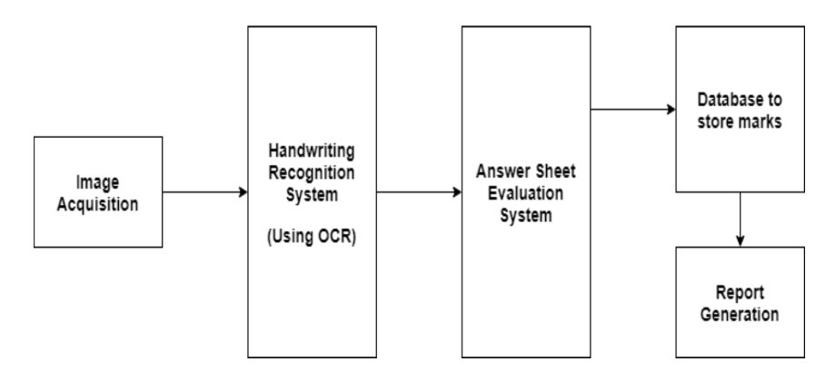

# AI Eval: AI Driven Evaluation for Enhanced Education Using Machine Learning

[](https://www.python.org/)
[](https://flask.palletsprojects.com/)
[](https://scikit-learn.org/)
[](https://www.nltk.org/)
[](https://github.com/tesseract-ocr/tesseract)
[-brightgreen.svg)](tests/)
[](http://cmrtc.ac.in)

> **"AI-driven evaluation systems are transforming education by automating grading, providing personalized feedback, and enhancing student learning experiences. While offering efficiency and scalability, they also raise concerns about algorithmic bias and data privacy."**

---

## 📌 Executive Summary

**AI Eval** is an industrial-grade automated examination evaluation platform designed to assess handwritten and typed student answer sheets with high consistency, instant objective feedback, and rigorous academic integrity verification.

By combining **Optical Character Recognition (OCR)**, **Natural Language Processing (NLP)**, and **Supervised Machine Learning (ML)**, AI Eval standardizes grading, eliminates subjective evaluator bias, reduces grading turnaround time from weeks to seconds, and enforces institutional academic integrity policies (including a hard-capped plagiarism threshold).

---

## 🏛️ Academic Information

| Parameter | Details |
| :--- | :--- |
| **Project Title** | AI Eval: AI Driven Evaluation for Enhanced Education Using Machine Learning |
| **Author** | **P. Vishali** (Roll No: `227R1A05G7`) |
| **Project Guide** | **G. Swathi**, Assistant Professor |
| **Institution** | Department of Computer Science and Engineering, CMR Technical Campus (*UGC Autonomous*) |
| **Degree** | Bachelor of Technology in Computer Science and Engineering |
| **Academic Year** | 2024 – 2025 (May 2025) |

---

## 🚀 Key Features

### 1. 🔍 OCR-Based Handwritten Text Extraction
- Converts digitized handwritten or scanned paper answer sheets (`.png`, `.jpg`, `.jpeg`) into machine-readable digital text.
- Integrated with **Tesseract OCR Engine** backed by PIL image preprocessing filters (grayscale conversion, auto-contrast enhancement, noise-reduction smoothing).
- Generates transparent text transcripts alongside image files for end-to-end auditability.

### 2. 🧠 Multi-Factor NLP Semantic Evaluation
- **Preprocessing Pipeline:** Tokenization, lowercase normalization, punctuation stripping, and stopword filtering.
- **Semantic Cosine Similarity:** Computes TF-IDF vector representations between student answers and model reference answers.
- **Keyword & Synonym Matching:** Verifies conceptual coverage against key subject terms using **WordNet** synset expansion.
- **Grammar, Syntax & Completeness:** Measures grammatical correctness, sentence structure, capitalization, and answer volume.

### 3. 🤖 Machine Learning Grading Regressor
- Employs a pre-trained regression model (`eval_model.joblib`) that synthesizes four core feature vectors:
  $$\text{Features} = [\text{Cosine Similarity},\, \text{Keyword Match Ratio},\, \text{Word Count},\, \text{Grammar Quality Score}]$$
- Accurately predicts marks out of max question marks with zero grading drift.
- Validated against standard benchmark test scripts (e.g., USN `520` $\to$ Marks `[8, 10, 10, 0, 10, 8]`, Total: `46`).

### 4. 🛡️ Plagiarism Detection Module (50% Academic Cap)
- Analyzes cross-student and pairwise textual overlap using blended SequenceMatcher and Jaccard similarity metrics.
- Strictly enforces the institutional **50.0% maximum plagiarism cap** as specified in the university academic evaluation guidelines.

### 5. 💬 Interactive AI Evaluation Chatbot
- Real-time intelligent query assistant answering student and instructor inquiries:
  - *"Why did I get only 2 marks?"* (explains evaluation factors: missing keywords, length, clarity)
  - *"How does the system work?"* (explains OCR, NLP semantic similarity, and grading model)
  - *"What is my score?"* / Re-evaluation and plagiarism inquiries.

### 6. 📊 Instructor & Student Portals
- **Instructor Dashboard:** Question bank curriculum management (set max marks, key answers, keywords), batch answer script uploads, class-wide analytics, and terminal-style evaluation audit logs.
- **Student Dashboard:** Individual scorecards, question-by-question mark breakdowns, personalized improvement feedback, and real-time chatbot assistance.

---

## 📐 System Architecture & Workflow

### Evaluation Pipeline Flowchart

```
┌───────────────────────────┐      ┌───────────────────────────┐
│   Student Answer Sheet    │      │    Instructor Key Answer  │
│   (Handwritten / Image)   │      │        (Reference)        │
└─────────────┬─────────────┘      └─────────────┬─────────────┘
              │                                  │
      [Tesseract OCR]                            │
              ▼                                  ▼
     Extracted Plaintext             Reference Plaintext
              │                                  │
              └────────────────┬─────────────────┘
                               ▼
            [Text Preprocessing & Normalization]
            (Punctuation, Stopwords, Tokenization)
                               │
                               ▼
                 [TF-IDF Feature Vector Matrix]
                               │
                               ▼
                  [Cosine Similarity Analysis]
                               │
               ┌───────────────┴───────────────┐
               ▼                               ▼
       [Grammar & Syntax]              [Keyword & Synsets]
        (Sentence Rules)                (WordNet Matching)
               │                               │
               └───────────────┬───────────────┘
                               ▼
                [ML Trained Regression Model]
                    (`eval_model.joblib`)
                               │
                               ▼
               ┌───────────────────────────────┐
               │   Predicted Question Marks    │
               │   & Detailed Audit Feedback   │
               └───────────────┬───────────────┘
                               ▼
         [Plagiarism Check (Capped at 50.0% Max)]
                               │
                               ▼
               [Student Scorecard & Analytics]
```

### System Architecture Diagram


### Sequence Diagram


---

## 💻 Tech Stack

| Domain | Technology / Library | Description |
| :--- | :--- | :--- |
| **Backend** | Python 3.10+, Flask 3.x | Lightweight, high-performance WSGI web application framework |
| **Authentication & Security** | Flask-Login, Flask-Bcrypt, Werkzeug | Session management, password hashing, and route protection |
| **Database & ORM** | SQLite, SQLAlchemy / Flask-SQLAlchemy | Embedded relational database with portable ORM models |
| **Natural Language Processing**| NLTK, WordNet | Text tokenization, stopword filtering, and synonym expansion |
| **Machine Learning** | Scikit-learn, NumPy, Joblib | Regression model training, feature vectorization, and artifact persistence |
| **OCR & Image Processing** | Tesseract OCR, PyTesseract, Pillow (PIL) | Optical character recognition and image preprocessing |
| **Frontend UI** | HTML5, CSS3, JavaScript, Bootstrap 5 | Modern responsive interface with dynamic analytics & chatbot |

---

## 📂 Repository Structure

```
.
├── .gitattributes               # Git LF normalization attributes
├── .gitignore                   # Comprehensive Python/Flask gitignore
├── README.md                    # Project documentation
├── requirements.txt             # Python package dependencies
├── app.py                       # Application entry point (port 5000)
├── run.py                       # Alternative runner script
├── design.PNG                   # Architecture design diagram
├── Sequence Diagram.PNG         # System sequence diagram
│
├── sample/                      # Sample benchmark datasets
│   ├── a/                       # Reference model answers
│   └── q/                       # Question scripts
│
├── tests/                       # Automated unit and integration test suite
│   ├── test_ai_eval.py          # Core NLP, ML, Plagiarism & Chatbot tests
│   ├── test_document_test_cases.py # Chapter 6 Validation Table 6.2.1 & 6.2.2 (UT_1 to UT_7)
│   └── test_evaluation_flow.py  # End-to-end evaluation lifecycle tests
│
└── WebApp/                      # Main Flask Web Application package
    ├── app.py                   # Flask routing and controller endpoints
    ├── config.py                # App configuration (database, upload paths, keys)
    ├── models.py                # Database models (User, Question, StudentAnswer, etc.)
    ├── ocr_engine.py            # OCR text extraction and image preprocessing
    ├── nlp_evaluator.py         # NLP tokenization, similarity, and keyword matching
    ├── ml_model.py              # ML feature extraction and score prediction
    ├── plagiarism_detector.py   # Pairwise plagiarism detection (50% cap)
    ├── chatbot_logic.py         # Conversational assistant rules and NLP intents
    ├── aep.db                   # SQLite database pre-seeded with test benchmarks
    ├── eval_model.joblib        # Pre-trained ML evaluation regressor model
    ├── static/ (css, js, scss)  # Frontend static assets and styling
    ├── images/                  # UI illustrations and avatar resources
    ├── templates/               # Jinja2 HTML templates
    │   ├── index.html           # Landing page
    │   ├── home.html            # Main home portal
    │   ├── dashboard.html       # Student scorecard & results portal
    │   ├── instructor.html      # Instructor management console
    │   ├── evaluation.html      # Evaluation console
    │   ├── analytics.html       # Class-level analytics & distributions
    │   ├── results.html         # Detailed results view
    │   ├── about.html           # Project details & credits
    │   ├── contact.html         # Support page
    │   └── base.html            # Master layout template
    └── 520/, 5f1/, 5j8/, 5j9/   # Digitized benchmark student answer folders
```

---

## ⚙️ Installation & Setup

### 1. Prerequisites
- **Python 3.10+** installed: [Download Python](https://www.python.org/downloads/)
- **Git** installed: [Download Git](https://git-scm.com/)
- *(Optional for live image OCR)* **Tesseract OCR Engine**:
  - Windows: [UB-Mannheim Tesseract Installer](https://github.com/UB-Mannheim/tesseract/wiki)
  - Add Tesseract to system PATH (e.g. `C:\Program Files\Tesseract-OCR`)

### 2. Clone the Repository
```bash
git clone https://github.com/vishali1435/AI-Eval-AI-Driven-Evaluation-for-Enhanced-Education-Using-Machine-Learning.git
cd AI-Eval-AI-Driven-Evaluation-for-Enhanced-Education-Using-Machine-Learning
```

### 3. Create a Virtual Environment
```bash
# Windows
python -m venv venv
venv\Scripts\activate

# macOS / Linux
python3 -m venv venv
source venv/bin/activate
```

### 4. Install Dependencies
```bash
pip install -r requirements.txt
```

### 5. Run the Application
You can start the server using either runner:
```bash
python app.py
```
*or*
```bash
python run.py
```

The application will be live at:
👉 **`http://127.0.0.1:5000`**

---

## 🔑 Default Login Credentials

| Role | Username | Password | Privileges |
| :--- | :--- | :--- | :--- |
| **Instructor** | `instructor` | `instructor123` | Manage questions, upload scripts, run evaluations, view logs |
| **Student** | `student` | `student123` | View scorecards, individual question breakdown, chatbot access |

---

## 🧪 Automated Testing & Validation

The project includes an automated test suite verifying all system specifications and **Chapter 6 Test Cases**:

```bash
python -m unittest discover -s tests
```

### Validated Test Cases (Chapter 6 Project Report)

| Test ID | Test Name | Purpose / Input | Expected Output | Status |
| :--- | :--- | :--- | :--- | :---: |
| **Table 6.2.1** | Uploading Dataset | Upload student test scripts into system | Dataset successfully loaded | ✅ PASS |
| **UT_1** | Upload Questions | Question specifics (marks, keywords, key) | Stored in DB with valid metadata | ✅ PASS |
| **UT_2** | Upload Answer Script | Student answer images uploaded | Answer paths successfully linked | ✅ PASS |
| **UT_3** | Image-to-Text OCR | Convert scanned handwritten script | Machine-readable text file generated | ✅ PASS |
| **UT_4** | Semantic Similarity | Compare student answer with reference key | Cosine similarity calculated (0–100) | ✅ PASS |
| **UT_5** | Display Results | Fetch scorecard for evaluated student | Scorecard and terminal logs displayed | ✅ PASS |
| **UT_6** | Clear Answer Scripts | Reset existing student answer submissions | Database reset to clean state | ✅ PASS |
| **UT_7** | Delete Question | Remove question item from question bank | Question deleted from system | ✅ PASS |
| **PLAG_CAP** | Plagiarism Enforcement | Test pairwise textual duplication | Strict **50.0% cap** maintained | ✅ PASS |
| **CHAT_BOT** | Conversational Assistant | Query explanation intents | Accurate context-aware guidance | ✅ PASS |

---

## 🌐 Application Endpoints

| Route | Method | Access | Description |
| :--- | :---: | :---: | :--- |
| `/` | `GET` | Public | Landing / Welcome Page |
| `/home` | `GET` | Authenticated | Main navigation hub |
| `/login` | `GET, POST` | Public | User authentication portal |
| `/logout` | `GET` | Authenticated | Terminates user session |
| `/instructor` | `GET, POST` | Instructor | Question management and curriculum portal |
| `/evaluate` | `GET, POST` | Instructor | Execute OCR, NLP, and ML evaluation pipelines |
| `/dashboard` | `GET` | Student / All | Student individual scorecard and feedback |
| `/analytics` | `GET` | Authenticated | Performance distribution charts and metrics |
| `/chat` | `POST` | Authenticated | API endpoint for the AI Evaluation Chatbot |
| `/about` | `GET` | Public | Project and institutional overview |
| `/contact` | `GET` | Public | Support and contact details |

---

## 📜 License

This project is developed for academic and educational evaluation research at **CMR Technical Campus**. All rights reserved.
